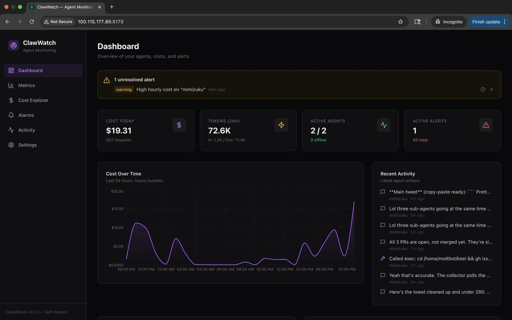
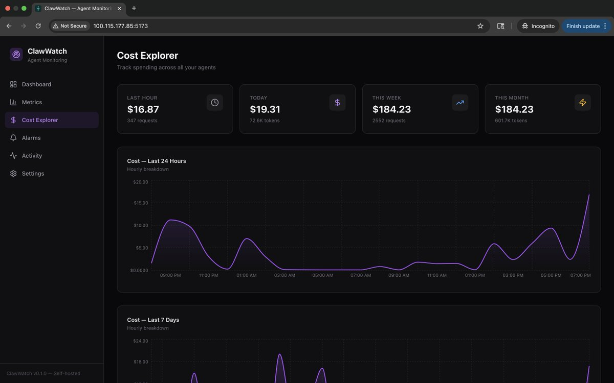

# 🔍 ClawWatch

<div align="center">

**PagerDuty for your AI agents**

[](https://opensource.org/licenses/MIT)
[](https://www.typescriptlang.org/)
[](https://www.docker.com/)
[](https://convex.dev/)

[Getting Started](#quick-start) · [Features](#features) · [Architecture](#architecture) · [Development](#development) · [Discord](https://discord.gg/clawd)

Monitor your AI agents' spending, performance, and behavior. Self-hosted. Real-time. Open source.

</div>

---

## Screenshots

<div align="center">

| Dashboard | Cost Explorer |
|-----------|---------------|
|  |  |

*Track agent status, costs, and activity at a glance*

</div>

---

## Quick Start

```bash
git clone https://github.com/0xdsqr/clawwatch.git && cd clawwatch
cp .env.example .env  # configure GATEWAY_URL + GATEWAY_TOKEN
docker compose up -d
# Open http://localhost:5173
```

---

## Features

- 📊 **Dashboard** — agent status, costs, alerts at a glance
- 💰 **Cost Explorer** — track every token and dollar
- 📈 **Metrics** — CloudWatch-style P50/P95/P99 latency, request rate, errors
- 🚨 **Alerts** — budget exceeded, agent offline, error spikes
- 📜 **Activity Feed** — what your agent actually did
- 🎯 **Snitch Score™** — how often does your agent tattle on you?

---

## Architecture

```
┌──────────────┐     HTTP API       ┌──────────────────┐
│  Clawdbot    │ ─────────────────▶ │ ClawWatch        │
│  Gateway     │   File System      │ Collector        │
└──────────────┘ ─────────────────▶ └────────┬─────────┘
                                             │
                                    Convex Mutations
                                             │
                                    ┌────────▼──────────┐
                                    │  Convex Backend   │
                                    │  (self-hosted)    │
                                    └────────┬──────────┘
                                             │
                                    Real-time Queries
                                             │
                                    ┌────────▼──────────┐
                                    │ ClawWatch         │
                                    │ Dashboard         │
                                    │ (React + Vite)    │
                                    └───────────────────┘
```

**Tech Stack:** React + Vite + Tailwind + Convex + Recharts + Bun

---

## Development

### Prerequisites

- Node.js 18+ or Bun
- Docker & Docker Compose

### Local Setup

```bash
# Install dependencies
bun install

# Start Convex backend
cd infra && docker compose up -d

# Configure environment
cp .env.example .env.local
# Edit .env.local with your GATEWAY_URL and GATEWAY_TOKEN

# Deploy schema
npx convex dev --once

# Start frontend
bun run dev

# Start collector (new terminal)
bun run collector/poll.ts
```

### Project Structure

```
clawwatch/
├── src/                 # React frontend
├── convex/             # Database schema & functions
├── collector/          # Data collection service
├── .github/assets/     # UI screenshots
└── docker-compose.yml  # Production deployment
```

---

## Built for the Claw Ecosystem

ClawWatch seamlessly integrates with [OpenClaw](https://github.com/openclaw/openclaw) and [Clawdbot](https://github.com/clawdbot/clawdbot), providing comprehensive monitoring for your AI agent infrastructure. Works with any agent platform that exposes compatible APIs.

---

## License

MIT License - see [LICENSE](LICENSE) for details.

---

<div align="center">

*Built with ❤️ for the AI agent community*

</div>