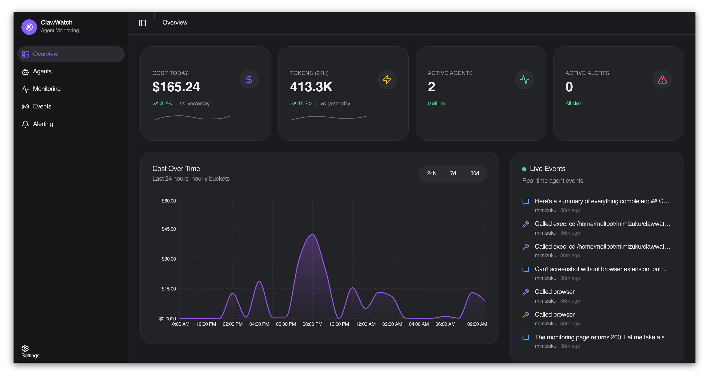
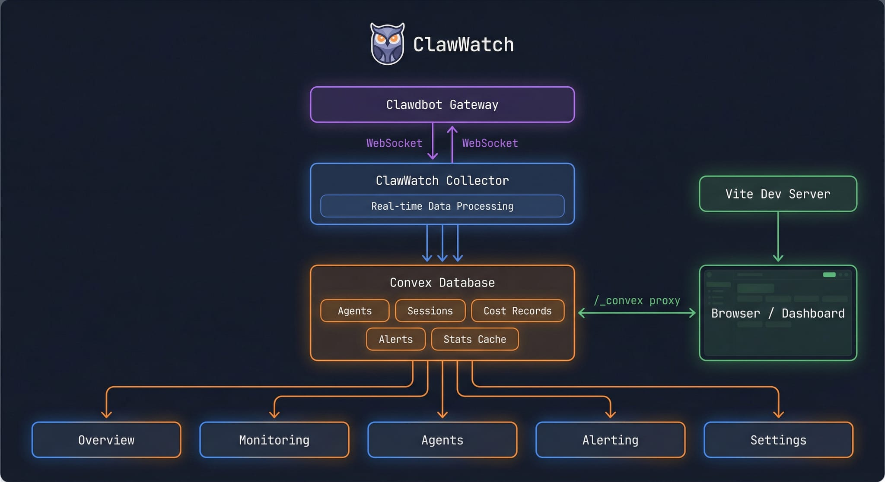

<div align="center">


<p>
  <a href="https://github.com/0xdsqr/clawwatch"></a>
  <a href="#"></a>
  <a href="#"></a>
  <a href="#"></a>
  <a href="#"></a>
</p>

**Self-hosted monitoring and cost management for AI agents.**

_Real-time visibility into costs, tokens, sessions, and system health from a single dashboard._

</div>

<p align="center">
  
</p>

---

ClawWatch is a local-first monitoring system for agentic AI agents. Connect your agents through a WebSocket gateway and track everything from a single pane of glass:

- 💸 **Real-time cost tracking** - Monitor spend across providers and models as it happens
- 🤖 **Multi-agent dashboard** - Unified view of all connected agents with live status and session breakdowns
- 🔔 **Smart alerting** - Rules for budget thresholds, offline detection, and anomalies
- 📡 **Live event stream** - Filterable log of agent activity
- 📊 **Token analytics** - Input/output/cache breakdowns with model comparisons
- 🏠 **Fully self-hosted** - Runs on your machine with a self-hosted Convex backend

**Quick Start**

```bash
bun install

cd packages/core && npx convex dev

cd apps/clawwatch && bun run dev
```

Set `GATEWAY_URL` and `GATEWAY_TOKEN` to connect the WebSocket collector to your agent gateway.

**Self-Hosting (Docker Compose)**

```bash
git clone https://github.com/0xdsqr/clawwatch.git
cd clawwatch/infra
cp .env.example .env
docker volume create clawwatch_convex-data
docker compose up -d
```

Edit `.env` with your gateway URL and token:

```
GATEWAY_URL=http://YOUR_HOST_IP:18789
GATEWAY_TOKEN=your_gateway_token_here
CONVEX_CLOUD_ORIGIN=http://YOUR_HOST_IP:3210
CONVEX_SITE_ORIGIN=http://YOUR_HOST_IP:3211
VITE_CONVEX_URL=http://YOUR_HOST_IP:3210
```

Use your machine’s IP (not `127.0.0.1`) if you access the dashboard from another device.

Single-command boot (after `.env` is set):

```bash
cd infra && docker compose up -d
```

Deploy the Convex schema:

```bash
docker compose exec convex-backend ./generate_admin_key.sh
cd ../packages/core
export CONVEX_SELF_HOSTED_URL=http://YOUR_HOST_IP:3210
export CONVEX_SELF_HOSTED_ADMIN_KEY=your_admin_key_here
npx convex dev --once
```

Open:

- ClawWatch UI: `http://YOUR_HOST_IP:5173`
- Convex Dashboard: `http://YOUR_HOST_IP:6791`

**Architecture**

Gateway → Collector → Convex → Dashboard.  
The collector ingests events and costs over WebSocket, writes into Convex, and the UI subscribes to real-time updates.



**Development**

With Bun:

```bash
bun install
cd packages/core && npx convex dev --once
cd apps/clawwatch && bun run dev
```

With Nix:

```bash
nix develop
bun install
```

Formatting:

```bash
nix fmt .
# or
bun run format
```

**Stack**

- **Frontend**: React 19, TanStack Router, Tailwind CSS 4, Recharts
- **Backend**: Convex (real-time database + API)
- **Runtime**: Bun
- **Collector**: WebSocket + polling for live data ingestion

**License**

MIT — do whatever you want with it.
